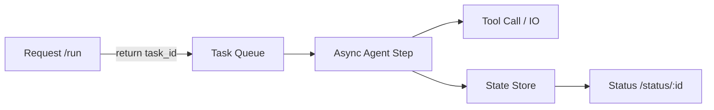

# easy_claude_code

[English Version](./README_EN.MD) | 中文版


## 项目描述
本项目（easy_claude_code）是一个旨在通过最精简的代码实现 AI Agent（智能体）核心逻辑的教学项目。它模仿了 Claude Code 的基本工作原理：**模型思考 → 工具调用 → 自动迭代循环**。通过本项目，你可以亲手构建一个能操作本地文件、执行系统命令并带有安全护栏的 AI 助手，从而真正将“Agent 概念”转化为“工程直觉”。

---

## 目录
- [亮点](#亮点)
- [架构一图](#架构一图)
- [v1 vs v2 对比](#v1-vs-v2-对比)
- [快速上手](#快速上手)
- [核心功能](#核心功能)
- [常见问题](#常见问题)

## 亮点
- **极简可跑**：保留 Agent 的骨架，让“模型是决策者”这件事一眼可见。
- **v1 同步循环**：最小的 while-loop Agent，适合新手理解核心闭环。
- **v2 异步版本**：任务解耦 + step 状态机，避免请求线程被占用。
- **工程安全护栏**：危险命令拦截、超时、输出截断。

## 架构一图


## v1 vs v2 对比
| 维度 | v1_basic_agent | v2_async_agent |
|---|---|---|
| 执行模型 | 同步 while loop | 异步 step 状态机 |
| 请求生命周期 | 容易阻塞 | 任务解耦，不阻塞 |
| 适用场景 | CLI 教学/本地实验 | Web 服务/并发场景 |
| 可扩展性 | 低 | 高（可接入 Redis/DB） |

## 现在的进度（随代码实测更新）
- `easy_cil.py`：带安全黑名单、退出码回传、输出截断的命令执行 Agent，黑名单覆盖 rm/sudo 以及 vim/top/less 等会挂起交互的指令。
- `v1_basic_agent.py`：约 200 行的教学版循环，4 个函数工具（bash/read_file/write_file/edit_file），默认直连 DeepSeek `deepseek-chat`。
- `v2_async_agent.py`：异步版 Agent（任务解耦 + step 状态机），提交任务返回 task_id，可通过 status 查询进度。
- `.env`/环境变量：支持通过 `DEEPSEEK_API_KEY`、`DEEPSEEK_MODEL` 配置；未设定时会提示缺失。

## 快速上手
```bash
pip install openai python-dotenv
export DEEPSEEK_API_KEY=你的key   # 或写入 .env
python v1_basic_agent.py
```
异步版（任务解耦 + 状态查询）：
```bash
python v2_async_agent.py
# run <prompt>
# status <task_id>
```
对话示例：
```
You: 列出当前目录
You: 读取 README.MD 前 40 行
You: 创建一个 demo.txt 写入 hello world
```

## 核心功能
- **核心 Agent 闭环**：模型自主决定工具调用顺序，直到完成任务。
- **本地工具访问**：执行 Shell、读写文件、小粒度编辑。
- **安全护栏**：高危命令二次确认，输出长度截断，执行超时保护。
- **多轮记忆**：对话历史累积，结果回灌给模型继续推理。

## 常见问题
**Q: 为什么 while + async 还是会堵？**  
A: 因为 async 只是语法；如果 loop 里不让出控制权（await/yield），事件循环仍会被占满。

**Q: v2 为啥要 step？**  
A: step 把工作拆成可控小段，既方便调度也支持取消/限流/持久化。

**Q: 要上生产还差什么？**  
A: 状态外置（Redis/DB）、任务取消、并发限流、超时重试等。
