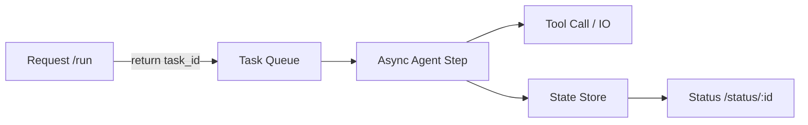

# easy_claude_code

English Version | [中文版](./README.MD)


## Project Description
`easy_claude_code` is a minimalist educational project designed to implement the core logic of an AI Agent with the simplest possible code. It mimics the fundamental working principles of Claude Code: **Model Thinking → Tool Calling → Automated Iterative Loop**. Through this project, you can build your own AI assistant capable of manipulating local files, executing system commands, and implementing safety guardrails, thereby transforming "Agent concepts" into "engineering intuition."

---

## Contents
- [Highlights](#highlights)
- [Architecture (one glance)](#architecture-one-glance)
- [v1 vs v2](#v1-vs-v2)
- [Quick start](#quick-start)
- [Features](#features)
- [FAQ](#faq)

## Highlights
- **Minimal but runnable**: the core loop is visible at a glance.
- **v1 sync loop**: smallest while-loop agent for learning the basics.
- **v2 async**: task decoupling + step state machine to avoid blocking requests.
- **Safety guardrails**: dangerous-command blocks, timeouts, output truncation.

## Architecture (one glance)


## v1 vs v2
| Dimension | v1_basic_agent | v2_async_agent |
|---|---|---|
| Execution | sync while loop | async step state machine |
| Request lifecycle | can block | decoupled, non-blocking |
| Best for | CLI demos / local tests | web services / concurrency |
| Scalability | low | high (Redis/DB ready) |

## Current state (kept in sync with code)
- `easy_cil.py`: command-running agent with safety blacklist, exit-code return, output truncation, and blocks for interactive TUIs (vim/top/less) plus rm/sudo style danger.
- `v1_basic_agent.py`: ~200-line teaching agent exposing 4 function tools (bash/read_file/write_file/edit_file), defaults to DeepSeek `deepseek-chat`.
- `v2_async_agent.py`: async agent (task decoupling + step state machine); submit returns task_id, poll status anytime.
- Env config: `DEEPSEEK_API_KEY` / `DEEPSEEK_MODEL`; missing keys are detected and warned.

## Quick start
```bash
pip install openai python-dotenv
export DEEPSEEK_API_KEY=your_key   # or put in .env
python v1_basic_agent.py
```
Async version (task decoupling + status polling):
```bash
python v2_async_agent.py
# run <prompt>
# status <task_id>
```
Try prompts:
```
You: list current directory
You: read README_EN.MD first 40 lines
You: create demo.txt with hello world
```

## Features
- **Core agent loop**: model autonomously chains tool calls until done.
- **Local tool access**: run shell, read/write files, surgical edits.
- **Safety guardrails**: dangerous-command confirmation, output truncation, timeouts.
- **Multi-turn memory**: tool results are fed back so the model can iterate.

## FAQ
**Q: Why does while + async still block?**  
A: async is syntax only; without awaits/yields inside the loop, the event loop is still monopolized.

**Q: Why step?**  
A: step breaks work into bounded slices so we can schedule, cancel, and persist safely.

**Q: What’s missing for production?**  
A: external state (Redis/DB), cancellation, concurrency limits, and robust retries/timeouts.
